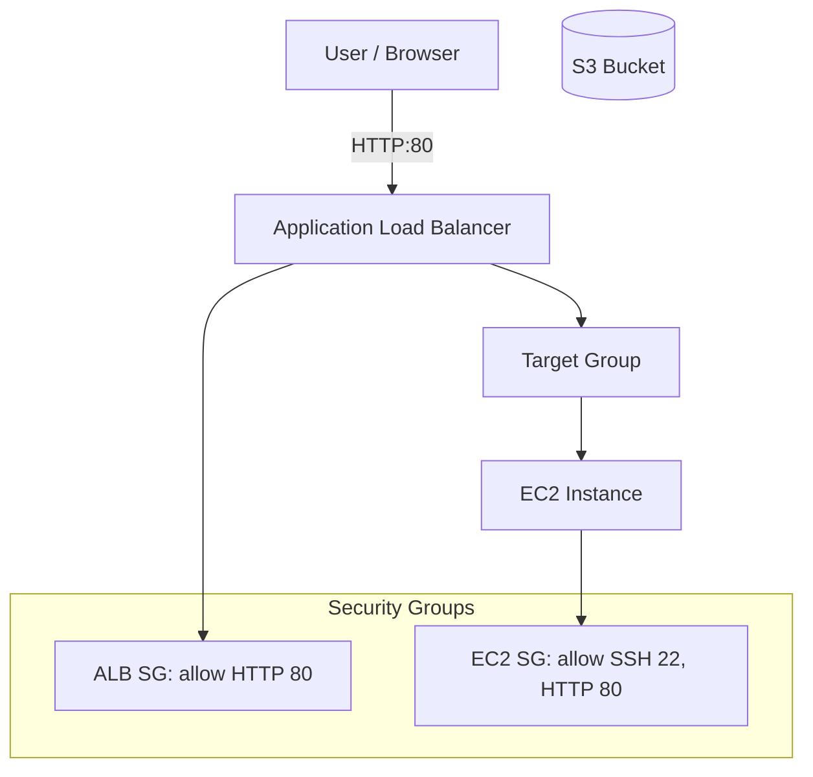

# Grocery Infrastructure on AWS (Terraform)

This project provisions a simple cloud infrastructure on *AWS* using *Terraform*.  
It was built as part of my learning journey in *Cloud & DevOps* 🚀  

## Diagram



## Architecture

The infrastructure includes:
•⁠  ⁠*EC2 Instance* running inside a public subnet
•⁠  ⁠*Application Load Balancer (ALB)* in front of the EC2
•⁠  ⁠*Target Group* registering the EC2 instance
•⁠  ⁠*Security Groups* for ALB and EC2 (allowing HTTP/SSH traffic)
•⁠  ⁠*S3 Bucket* for object storage
•⁠  ⁠*Key Pair* for SSH access

## Requeriments

• Terraform >= 1.5
• AWS Account + configured credentials
(aws configure)
• SSH key pair (public key for EC2)

## Variables

Defined in variables.tf: 
* variable "region" {} 
* variable "project_name" {}
* variable "public_key" {}
* variable "vpc_id" {}
* variable "ami_id" {}
* variable "instance_type" {}
* variable "public_subnets" {
  * type = list(string)
}

## Usage
1. Clone the repository

```bash
git clone https://github.com/AllineWamsser/terraform_aws.git
```
2. Initialize Terraform
```bash 
terraform init
```
3. Validate the code
````bash
terraform validade
````
4. See the execution plan
````bash
terraform plan
````
5. Apply the infrastructure
````bash
terraform apply
````
6. to destroy everything later
```bash
terraform destroy
```

## Notes
The S3 bucket name incluides a random suffix to avoid conflicts.
Default ACL is set to private.
Remember to cleian up (terraform destroy) to avoid unnecessary AWS costs.

